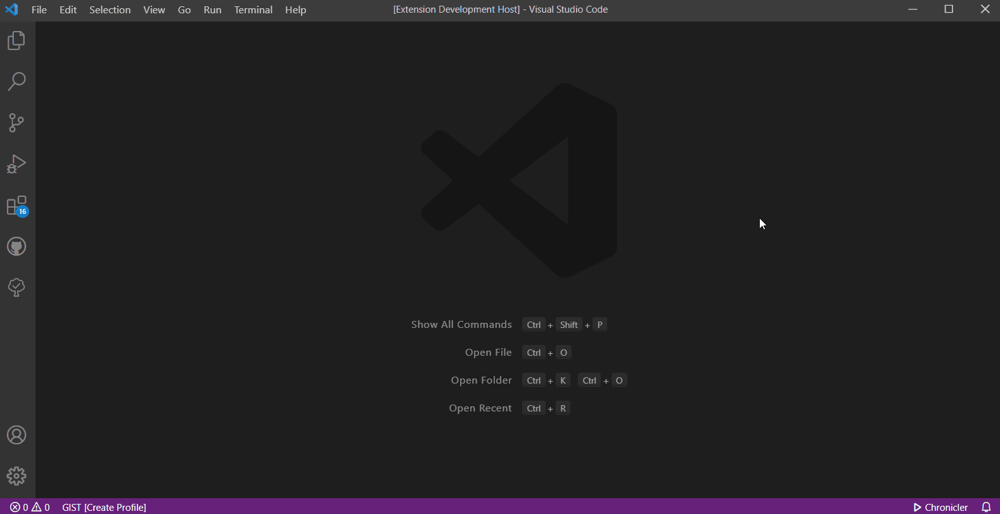
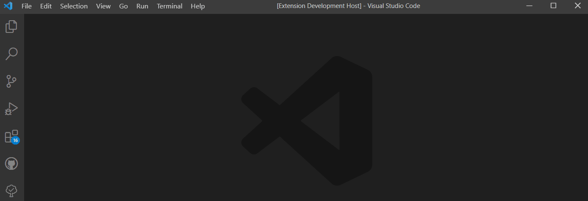
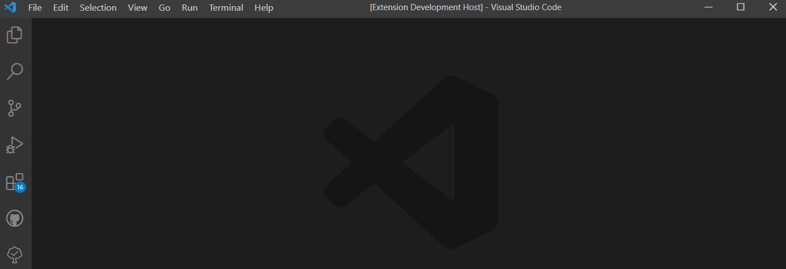

# Growi Client

VSCodeからGrowiのページ編集・閲覧を行うための拡張機能.

Growi 4.2.21でテスト済み.

**注意** : この拡張機能は, 編集者が1人であることを前提としています. 複数人での使用は推奨しません.

# インストール

 [MarketPlace](https://marketplace.visualstudio.com/items?itemName=k-kuroguro.growi-client)からインストール または,
 [リリース](https://github.com/k-kuroguro/vscode-growi-client/releases)から最新のバージョンをダウンロードして, VSCodeにインストールしてください. ([参考](https://code.visualstudio.com/docs/editor/extension-marketplace#_install-from-a-vsix))

# セットアップ

GrowiのApi Tokenをユーザー設定から取得しておいてください.\
コマンド`Growi Client: Set Growi URL`, `Growi Client: Set Api Token`を実行し, URL/Api Tokenを入力します.

# 使い方

## ページ作成

コマンド `Growi Client: New Page`を実行します.\
作成するページのパスを入力すると, エディタが開くので本文を入力, 保存してください.

**注意**: 本文が空の状態では保存できません.

## ページを開く

コマンド `Growi Client: Open Page`を実行します.\
作成するページのパスを入力すると, エディタが開きます.
